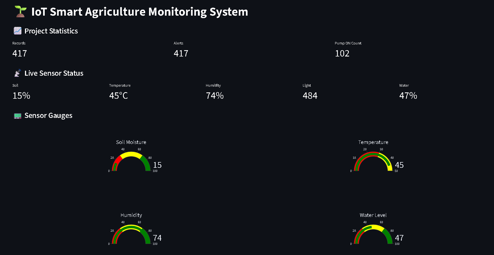
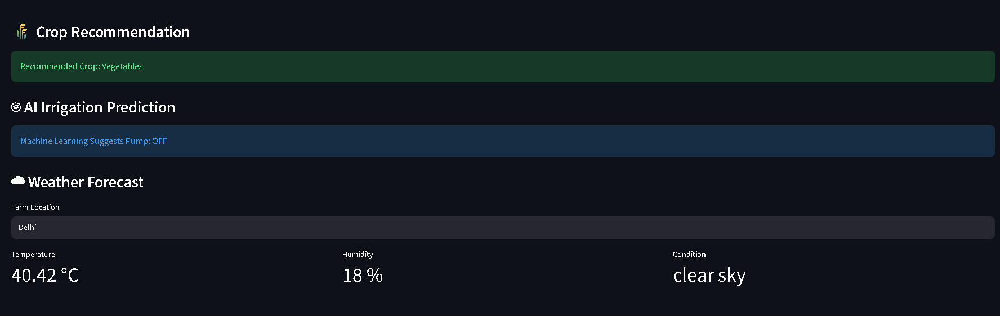
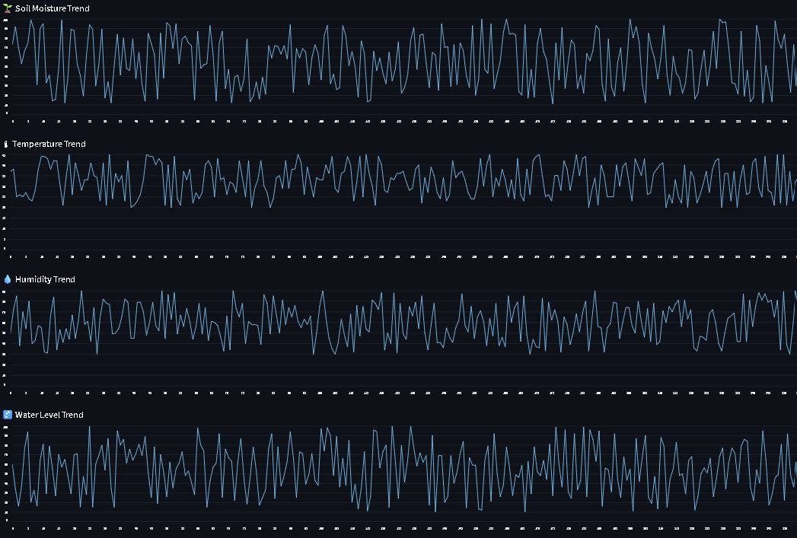
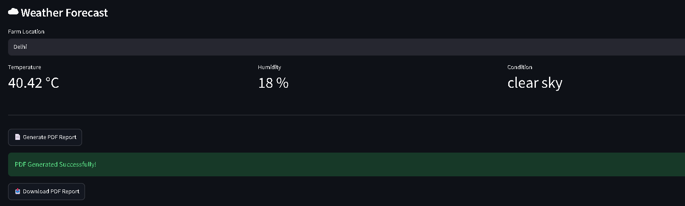
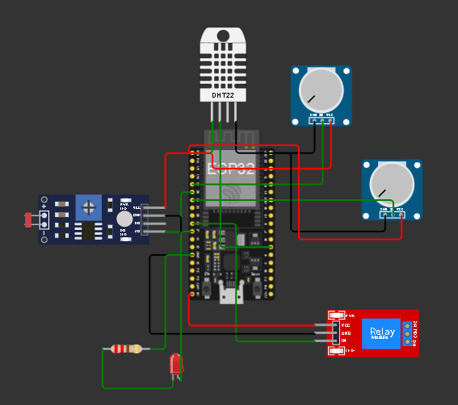
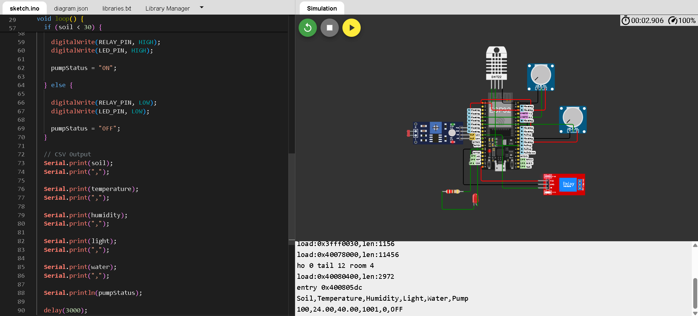

# 🌱 IoT Smart Agriculture Monitoring System

An end-to-end IoT-based Smart Agriculture Monitoring System that enables real-time monitoring of environmental conditions, automated irrigation recommendations, crop suggestions, weather forecasting, and data visualization through an interactive Streamlit dashboard.

## 🚀 Live Demo

🌐 Streamlit Application:

https://iot-smart-agriculture-monitoring-system-7nu8zmqq2dshjjdhsmlnbn.streamlit.app/

📂 GitHub Repository:

https://github.com/Vayu-143/IoT-Smart-Agriculture-Monitoring-System

---

## 👨‍💻 Author

**Vayunandan Mishra**

B.Tech Student | IoT & AI Enthusiast

---

# 📖 Project Overview

Modern agriculture requires efficient resource management and real-time monitoring to improve crop productivity while reducing water consumption.

This project integrates:

- IoT Sensors
- ESP32 Microcontroller
- Machine Learning
- Streamlit Dashboard
- PDF Reporting
- Weather Forecasting

to create a smart farming solution capable of monitoring field conditions and assisting farmers in making data-driven decisions.

The system continuously monitors:

- Soil Moisture
- Temperature
- Humidity
- Water Level
- Light Intensity

and provides:

- Crop Recommendation
- AI-based Irrigation Prediction
- Alert Generation
- Weather Information
- Historical Trend Analysis

Similar IoT agriculture systems commonly combine sensor monitoring, automation, cloud connectivity, and decision support for precision farming. :contentReference[oaicite:0]{index=0}

---

# ✨ Features

## 🌡 Real-Time Environmental Monitoring

Monitor:

- Temperature
- Humidity
- Soil Moisture
- Water Level
- Light Intensity

---

## 🌾 Crop Recommendation System

Suggests suitable crops based on:

- Soil Moisture
- Temperature
- Humidity

---

## 🤖 AI Irrigation Prediction

Machine Learning model predicts whether irrigation should be:

- ON
- OFF

based on current field conditions.

---

## ☁ Weather Forecast Integration

Displays:

- Current Temperature
- Humidity
- Weather Condition

using OpenWeather API.

---

## 📈 Interactive Dashboard

Built using Streamlit.

Provides:

- Live Metrics
- Sensor Gauges
- Trend Charts
- Alert History
- Data Tables

---

## 📄 PDF Report Generation

Generate downloadable reports containing:

- Sensor Readings
- Crop Recommendation
- Irrigation Prediction
- Weather Information

---

## 🔄 Dashboard Controls

- Refresh Dashboard
- Generate New Data
- Clear Data
- Download PDF Report

---

# 🏗 System Architecture

```text
                    ┌──────────────────┐
                    │      Sensors     │
                    │                  │
                    │ DHT22            │
                    │ Soil Moisture    │
                    │ Water Level      │
                    │ Light Sensor     │
                    └─────────┬────────┘
                              │
                              ▼
                    ┌──────────────────┐
                    │      ESP32       │
                    │ Data Collection  │
                    └─────────┬────────┘
                              │
                              ▼
                    ┌──────────────────┐
                    │  Python Backend  │
                    │ Data Processing  │
                    └─────────┬────────┘
                              │
          ┌───────────────────┼───────────────────┐
          ▼                   ▼                   ▼
 ┌─────────────┐    ┌────────────────┐   ┌──────────────┐
 │ Crop Model  │    │ Irrigation ML │   │ Weather API  │
 └─────────────┘    └────────────────┘   └──────────────┘
          │                   │                   │
          └───────────────────┴───────────────────┘
                              │
                              ▼
                    ┌──────────────────┐
                    │ Streamlit UI     │
                    │ Dashboard        │
                    └─────────┬────────┘
                              │
                              ▼
                    ┌──────────────────┐
                    │ PDF Reporting    │
                    └──────────────────┘
```

---

# 🧰 Technologies Used

## Hardware

- ESP32
- DHT22 Sensor
- Soil Moisture Sensor
- Water Level Sensor
- LDR Sensor
- Relay Module
- LED

---

## Software

- Python
- Streamlit
- Pandas
- NumPy
- Scikit-Learn
- Plotly
- Joblib
- ReportLab
- Requests

---

# 📂 Project Structure

```text
IoT-Smart-Agriculture-Monitoring-System
│
├── arduino_code/
│   └── smart_agriculture.ino
│
├── dashboard/
│   └── dashboard.py
│
├── ml/
│   ├── irrigation_model.py
│   ├── irrigation_model.pkl
│   └── predict_irrigation.py
│
├── weather/
│   └── weather_service.py
│
├── utils/
│   └── pdf_report.py
│
├── data/
│   └── sensor_data.csv
│
├── docs/
│   ├── architecture.md
│   └── project_report.md
│
├── outputs/
│   └── reports/
│
├── requirements.txt
├── README.md
└── main.py
```

---

# ⚙ Installation

## Clone Repository

```bash
git clone https://github.com/Vayu-143/IoT-Smart-Agriculture-Monitoring-System.git

cd IoT-Smart-Agriculture-Monitoring-System
```

---

## Create Virtual Environment

```bash
python -m venv venv
```

### Windows

```bash
venv\Scripts\activate
```

### Linux/Mac

```bash
source venv/bin/activate
```

---

## Install Dependencies

```bash
pip install -r requirements.txt
```

---

## Run Dashboard

```bash
streamlit run dashboard/dashboard.py
```

---

# 🔌 Wokwi Simulation

The project includes an ESP32 simulation using:

- ESP32
- DHT22
- Soil Moisture Sensor
- Water Sensor
- LDR Sensor
- Relay Module

Sensor data is generated and used to test dashboard functionality.

---

# 📊 Dashboard Preview

### Features Available

✔ Live Sensor Monitoring

✔ Crop Recommendation

✔ AI Irrigation Prediction

✔ Weather Forecast

✔ PDF Report Generation

✔ Historical Charts

✔ Alert Tracking

✔ Data Management

---
# 📸 Project Screenshots

## 🏠 Dashboard Home



---

## 🤖 AI Features

Includes:

- Crop Recommendation
- AI Irrigation Prediction



---

## 📈 Sensor Trends

Historical visualization of:

- Soil Moisture
- Temperature
- Humidity
- Water Level



---

## ☁ Weather Forecast & PDF Report

Real-time weather monitoring and downloadable reports.



---

## 🔌 Circuit Diagram

ESP32-based IoT Smart Agriculture Hardware Setup.



---

## 🖥 Serial Monitor Output

Live sensor readings generated by ESP32 simulation.



---

# 🎯 Future Enhancements

- MQTT Integration
- Firebase Database
- ThingSpeak Live Data
- Mobile Application
- AI Yield Prediction
- Disease Detection using Computer Vision
- Multi-Farm Support

---

# 📜 License

This project is developed for educational and research purposes.

Feel free to use, modify, and improve it.

---

# ⭐ Support

If you found this project useful:

⭐ Star the repository

🍴 Fork the project

🛠 Contribute improvements

📢 Share with others

---

**Made with ❤️ by Vayunandan Mishra**